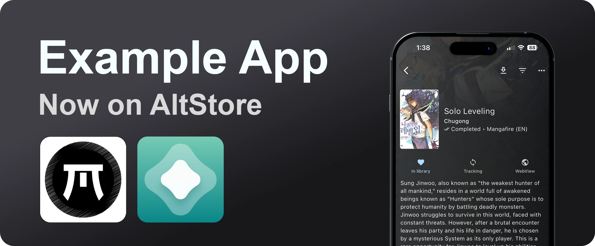

[
    
](repo/images/headers/source_header.webp)

# AltStore/Feather/SideStore Source and Signing

This repo should contain all the necessary information and files to get you started.

## Workflow Actions

### Build, Sign, Release, Update Source

Including all of the steps as part of a GitHub workflow action is the most straightforward and integrated solution.  
I'd recommend looking at the [zsign build.yml](.github/workflows/build-zsign.yml) and [ipasign.cc build.yml](.github/workflows/build-ipasign.yml) implementations.  
In these examples we:

- Decode the `.p12` and `.mobileprovison` base64 encoded GitHub secrets to files
- Build the `.app`
- Sign the `Payload`
  - You can sign the `.ipa` directly if using `ipasign.cc`
- Archive to `.ipa`
- Call the sideloading source update workflow

The difference between these two examples is:

- zsign signs the app locally
- ipasign relies on a webservice

### Release Polling

If you don't have control of a project, or wish to create a 3rd party one, you can implement a workflow action to poll for releases.

For the [Apollo with ImprovedCustomAPI](https://github.com/Balackburn/Apollo) and [Mangayomi Source](https://github.com/tanakrit-d/mangayomi-source) projects, I implemented a cron schedule and steps to poll for new releases.  
The release version data is stored in [.current-release](https://github.com/Balackburn/Apollo/blob/main/.current-release) which it is compared against.

You can see an example here: [check_release.yml](.github/workflows/check_release.yml)

### Update Source

You can use a Python script ([update_source.py](repo/update_source.py)) which handles the updating of the source file, and then call it from a workflow action ([update_source.yml](.github/workflows/update_source.yml)).

It's a good idea to include the `needs:` attribute so that the source will only update if the dependant step executes as expected.  
A good example of this is in a multi-build workflow which creates a number of builds (such as Android, iOS, Linux).

The script will automatically add new versions to the source, strip tags from versions, purge news items for unavailable releases, and provide links to the new releases among other things.

You'll find the values used to populate `news` items in [config.json](repo/config.json]) which are loaded when the script executes.

The initial values in the source (excluding ["versions"] and ["news"]) will need to be manually populated when initially setting this up, as they do not pull from `config.json` and are essentially static.

## Sideloading Source

An AltStore/Feather/SideStore compatible source is just a `.json` file that the app can read.  
Users simply direct the app to the URL in order to add the source.

There are however a few things to keep in mind which we'll explore:

### Version

```json
"versions": [
    {
        "version": "2.9.2",
        "date": "2025-03-12T05:55:38Z",
        "localizedDescription": "Hello",
        "downloadURL": "https://github.com/tanakrit-d/cool-app/releases/download/v2.9.2/cool-app-iOS-v2.9.2.ipa",
        "size": 37657190
    }
]
```

AltStore will check if the version declared in the source matches the value inside the app's `Info.plist` file.

Although AltStore accepts non-conforming values in `version` (such as `15.2.3-hotfix`), because Apple enforces `[major].[minor].[patch]` these will never reconcile if an app is downloaded from a source.  
This does not apply to apps which are loaded directly as an `.ipa`, or with Feather etc.

See:

- [CFBundleShortVersionString](https://developer.apple.com/documentation/bundleresources/information-property-list/cfbundleshortversionstring)
- [App Versions](https://faq.altstore.io/developers/make-a-source#app-versions)

### Entitlements

```json
"appPermissions": {
    "entitlements": [
        {
            "name": "com.apple.developer.associated-domains"
        }
    ],
    "privacy": [
        {
            "name": "Camera",
            "usageDescription": "App needs camera access."
        }
    ]
}
```

AltStore enforces a declared vs. discovered entitlements check if an app is downloaded from a source.  
If you are unsure which entitlements are required, you can install the app from source and see which ones AltStore discovers.  
This does not apply to apps which are loaded directly as an `.ipa`, or with Feather etc.

See:

- [App Permissions](https://faq.altstore.io/developers/make-a-source#app-permissions)

### Image Assets

You can improve the visual look of a repo by including the following assets, and specify their paths in your `.json`:

[Icon](repo/images/icons/)  
[
    
](repo/images/icons/anymex.webp)

[Header](repo/images/headers/)  
[
    
](repo/images/headers/source_header.webp)

[Screenshots](repo/images/screenshots/)  
[
    
](repo/images/screenshots/image_0.webp)

[News](repo/images/news/)  
[
    
](repo/images/news/update.webp)

Check out an example here: [AnymeX](https://github.com/RyanYuuki/AnymeX)  
Additionally, you can access `.psd` templates here: [templates](repo/images/templates)

### URL Schema (Open in App)

#### URL Redirector

To allow a user to open a link to a signing app from a `.md` file, you'll need to prefix a URL redirection to handle it.
I recommend the use of Lucas Roland's [HTTP protocol redirector](https://github.com/intradeus/http-protocol-redirector).

You would then prefix the links with `https://intradeus.github.io/http-protocol-redirector?r=`

#### App URL Schemas

If you would like to provide buttons or links users can use to open the source/repo directly in app, you'll need to add the correct schema to the front:

`altstore://source?url=https://raw.githubusercontent.com/tanakrit-d/my-app/refs/heads/main/repo/source.json`  
`feather://source/https://raw.githubusercontent.com/tanakrit-d/my-app/refs/heads/main/repo/source.json`  
`sidestore://source?url=https://raw.githubusercontent.com/tanakrit-d/my-app/refs/heads/main/repo/source.json`

## Signing

**Note: This section is aimed towards users of AltStore and SideStore using unsigned apps.**

It is my understanding that AltStore and SideStore require an `.ipa` to have been signed in order to be installed.  
With Feather, eSign, KravaSign, Signulous etc. this isn't the case as you'll be signing the app with a developer certificate.

Generally, fakesigning with `ldid` or `pyzule-rw` is sufficient - especially if the app has been previously signed and simply had tweaks injected.  
For whatever reason however, some apps misbehave when fakesigned and open to a blank screen.

If an app is not signed, or improperly signed, AltStore tends to throw an error such as [this one](https://github.com/altstoreio/AltStore/issues/1034). This is quite common with multi-platform projects that are built with Flutter using the `--no-codesign` argument as they were never signed to begin with.

There are two solutions for this:

### Option 1: zsign

Using a revoked/expired `.p12` and `.mobileprovision`from [https://t.me/AppleP12](https://t.me/AppleP12) alongside [zsign](https://github.com/zhlynn/zsign) gives the app a valid signature.

I'd recommend viewing the [usage](https://github.com/zhlynn/zsign?tab=readme-ov-file#usage) section to understand which parameters may be of use to you.

To use this as part of the workflow, it's recommended to base64 encode the `.p12` and `.mobileprovision` files and store them as a GitHub secrets.

In the example workflow action, I use it with the following arguments:  
`./zsign -f -k ./certificate.p12 -p "$P12_PASSWORD" -m ./profile.mobileprovision ./build/ios/iphoneos/Payload/Runner.app`

> [!IMPORTANT]  
> As of `zsign v0.7` I don't recommend specifying an `-output` argument  
> This is because (at least on MacOS) there is a bug which causes the archiving of the `.ipa` to run endlessly until the device runs out of disk space

### Option 2: ipasign.cc

Using a revoked/expired `.p12` and `.mobileprovision`from [https://t.me/AppleP12](https://t.me/AppleP12) alongside a signing service such as [https://sign.ipasign.cc/](https://sign.ipasign.cc/) gives the app a valid signature.

Although ipasign doesn't expose any API endpoints, I have written a [sign-ipa.sh](scripts/sign-ipa.sh) script to interface with the website automatically which allows it to be used as part of a workflow action.

To use this as part of the workflow, it's recommended to base64 encode the `.p12` and `.mobileprovision` files and store them as a GitHub secrets.

The script takes the following arguments:  
`<input ipa>` `<.p12>` `<.p12 password>` `<.mobileprovision>` `<output ipa>`

An example of running the script is as follows:

```console
./scripts/sign-ipa.sh cool-app-unsigned.ipa certificate.p12 password123 profile.mobileprovision cool-app-signed.ipa

Signing .ipa with ipasign.cc
Upload in progress...
  % Total    % Received % Xferd  Average Speed   Time    Time     Time  Current
                                 Dload  Upload   Total   Spent    Left  Speed
100 35.9M  100   125  100 35.9M      3   981k  0:00:41  0:00:37  0:00:04 1070k
Signing in progress... attempt 1 of 10. Checking again in 20 seconds.
Signing in progress... attempt 2 of 10. Checking again in 20 seconds.
Signing successful. Proceeding to download.
  % Total    % Received % Xferd  Average Speed   Time    Time     Time  Current
                                 Dload  Upload   Total   Spent    Left  Speed
100 36.4M  100 36.4M    0     0  4507k      0  0:00:08  0:00:08 --:--:-- 5489k
Download complete: cool-app-signed.ipa
```

## Project Examples

[Apollo with ImprovedCustomAPI](https://github.com/Balackburn/Apollo)

- [x] Release Polling
- [x] Source Update
  - [x] Dual Source (Standard and No Extensions)

[Mangayomi Source](https://github.com/tanakrit-d/mangayomi-source)

- [x] Project Integrated
- [x] Signing Integrated
- [x] Source Update

[AnymeX](https://github.com/RyanYuuki/AnymeX)

- [x] Project Integrated
- [x] Signing Integrated
- [x] Source Update

## Additional

[AltStore - Make a Source](https://faq.altstore.io/developers/make-a-source)  
[Apple - Entitlements](https://developer.apple.com/documentation/bundleresources/entitlements)  
[ldid](https://github.com/ProcursusTeam/ldid)  
[pyzule-rw / cyan](https://github.com/asdfzxcvbn/pyzule-rw)  
[zsign](https://github.com/zhlynn/zsign)
